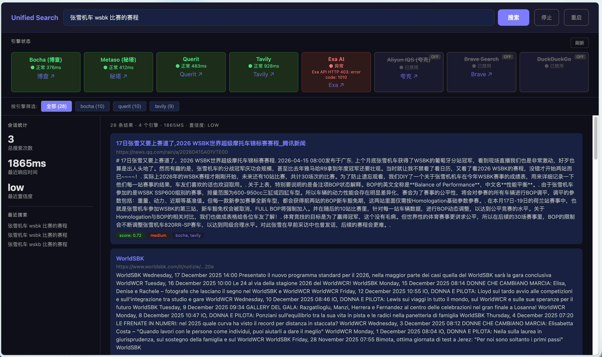

<div align="center">

# Unified Search

**Claude Code 搜索 Skill — 不靠单一引擎，靠交叉验证。**

[](https://www.python.org/downloads/)
[](LICENSE)
[]()

[English](README_EN.md) | 中文

</div>

---

## 一句话

Claude Code 搜索不需要猜。8 个引擎并行，结果互相验证——多个引擎都说有的才信，单一来源的标低置信度。

## 为什么不用单一引擎

模型自信满满引用一个来源，你点开一看——内容对不上，链接打不开。不是模型蠢，是单一来源本来就不靠谱。

统一 8 个引擎的结果：Exa、Tavily、Querit、Metaso、博查、Brave、DuckDuckGo、阿里云 IQS。同一个查询，同时发出去，结果交叉比对。只有被多个引擎独立确认的结果，才标记为高置信度。

```
"帮我查 Claude Code 最新功能"
        ↓
  ┌─ Exa ─────→ 结果 A
  ├─ Tavily ──→ 结果 A ✓ 交叉验证
  ├─ Metaso ──→ 结果 A ✓
  ├─ Brave ───→ 结果 B
  └─ DuckDuckGo → 结果 A ✓
        ↓
  结果 A: confidence=high（4 个引擎命中）
  结果 B: confidence=low（1 个引擎命中）
```



## 安装

零依赖，纯 Python 标准库。不需要 `pip install` 任何东西。

```bash
git clone https://github.com/NieAnSHOW/unified-search.git
cd unified-search
cp config.example.json config.json
# 编辑 config.json，填入至少 2 个引擎的 API Key
```

把项目放进 Claude Code 的 skills 目录，`SKILL.md` 自动激活。

## 用法

### 作为 Skill（推荐）

激活后直接跟 Claude Code 说就行，它会自动走多引擎管道：

> "帮我查一下 2026 年 AI 编程工具有哪些更新"
>
> "最近一周有什么科技新闻"
>
> "事实核查：XXX 这个说法是真的吗"

返回的结果带置信度标注。高置信度优先展示，低置信度附提醒。

### CLI

```bash
# 基础搜索
python3 dispatcher.py "Claude Code 2026 最新功能"

# 只看最近一周
python3 dispatcher.py "Claude Code 2026 最新功能" --freshness 1w

# 指定引擎
python3 dispatcher.py "Claude Code 2026 最新功能" --engines exa,tavily

# 精简输出
python3 dispatcher.py "Claude Code 2026 最新功能" --compact
```

### Dashboard

```bash
python3 dashboard.py --port 9728
```

浏览器打开 `http://localhost:9728`——引擎健康状态、搜索统计、在线测试，一目了然。或者直接跟 Claude Code 说「启动可视化页面」。

## 支持的引擎

| 引擎 | 类型 | 要 Key 吗 | 获取地址 |
|------|------|----------|---------|
| Exa | AI 搜索 | 要 | [dashboard.exa.ai](https://dashboard.exa.ai) |
| Tavily | AI 搜索 | 要 | [tavily.com](https://tavily.com) |
| Querit | AI 搜索 | 要 | [querit.ai](https://querit.ai) |
| Metaso（秘塔） | 中文搜索 | 要 | [metaso.cn](https://metaso.cn) |
| 博查 | 国内搜索 | 要 | [bocha.io](https://bocha.io) |
| Brave | Web 搜索 | 要 | [brave.com/search/api](https://brave.com/search/api) |
| DuckDuckGo | Web 搜索 | **不要** | 开箱即用 |
| 阿里云 IQS（夸克） | 云搜索 | 要 | [aliyun.com/product/iqs](https://www.aliyun.com/product/iqs) |

> 最低配 2 个引擎就能跑。DuckDuckGo 免费，先配上再说。

## 置信度

| 等级 | 条件 | 意思 |
|------|------|------|
| `high` | 3+ 引擎命中 | 可信 |
| `medium` | 2 个引擎命中 | 基本可信 |
| `low` | 1 个引擎命中 | 单一来源，自己再查查 |

## 加引擎

两步搞定：

1. `engines/` 下建文件，继承 `BaseEngine`，实现 `search()` 和 `_normalize()`
2. `config.json` 里加配置

dispatcher 自动发现，不用手动注册。

## License

[MIT](LICENSE)
